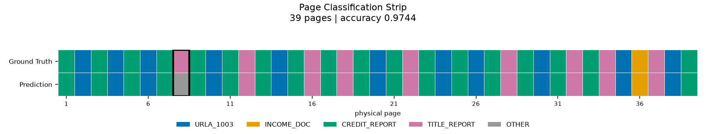
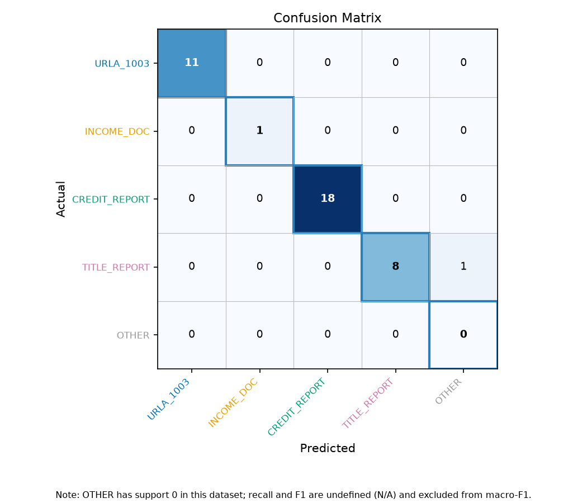

# MK Lending Document Classifier

셔플된 모기지 대출 서류 패키지 PDF의 각 페이지가 어떤 문서 유형인지 분류하고,
가능한 범위에서 원본 논리 문서를 재조립한다.

## 1. 개요

MK Lending Corp의 중장기 목표는 자체 AUS(Automated Underwriting System)
구축이다. AUS가 서류를 근거로 판정하려면 정확한 데이터 추출이 선행돼야 하는데,
실무 대출 패키지는 수십~수백 페이지가 순서 없이 하나로 합쳐진 PDF로 들어오기
때문에 그 전에 "이 페이지가 무슨 서류의 몇 번째 장인가"부터 판별하는 문서
분류·분할 단계가 필요하다. 이 프로젝트는 그 단계를 구현한다: 셔플된 PDF 한
개를 입력으로 받아 물리 페이지마다 5개 라벨 중 하나를 예측하고, 페이지 마커와
문서 식별자를 근거로 원본 문서 단위를 재구성한다. 룰 기반 분류를 1차로
사용하고, 룰이 확신하지 못하는 페이지만 LLM에 위임하는 하이브리드 구조를
채택했다 — 근거는 3절 참고. `data/package_01`을 대상으로 룰 전용(rule-only)
모드를 실행했을 때 accuracy 0.9744(38/39)를 확인했다.

## 2. 문서 유형

| 라벨 | 설명 |
|---|---|
| `URLA_1003` | 대출 신청서 (Uniform Residential Loan Application) |
| `INCOME_DOC` | 소득 증빙 서류 (급여명세서, W-2, 손익계산서 등) |
| `CREDIT_REPORT` | 신용조회 보고서 |
| `TITLE_REPORT` | 권원조사 보고서 (Preliminary Title Report) |
| `OTHER` | 위 네 유형에 해당하지 않거나 판정 불가 |

`DocType`(`src/schema.py`)에 정의된 값 그대로이며 임의로 축약하지 않는다.

## 3. 아키텍처

```
extract.py            PyMuPDF로 페이지 텍스트·회전·마커·식별자 추출
  │
rule_classifier.py    키워드 시그니처 스코어링, 위임(should_delegate) 판정
  │
llm_classifier.py     (위임된 페이지만) PII 마스킹 → 프롬프트 구성 → 배치 →
                      응답 검증 → 재시도/Fallback
  │
grouping.py           물리적 연속 그룹핑(필수) + 논리 문서 재조립(확장)
  │
evaluate.py           정답지 대조 (--truth 제공 시)
visualize.py          페이지 스트립·confusion matrix 이미지 (--viz 제공 시)
```

`pipeline.py`가 위 단계를 순서대로 호출하고 `scripts/run.py`가 CLI 진입점이다.

**룰 + LLM 결합 근거**: 룰 시그니처만으로 39페이지 중 37페이지가 결정론적으로
확정된다(4절). 남은 2페이지만 LLM 위임 대상으로 남기면 재현성(같은 입력에 같은
결과)을 유지하면서 애매한 페이지에만 추가 판단을 구할 수 있다. 전 페이지를
LLM에 보내는 방식은 실행마다 결과가 달라질 위험과 비용·속도 부담이 있어 채택하지
않았다 (11절).

## 4. 실행 방법

**환경**: Python 3.11 이상 (3.11.5에서 검증), 의존성은 `requirements.txt`. `.env.example`을 `.env`로
복사하고 `LLM_API_KEY`를 채우면 `hybrid` 모드가 활성화된다(키가 없으면 자동으로
rule-only와 동일하게 동작한다).

**주의**: 원본 파일명에 공백과 `&`가 포함되므로 모든 경로 인자를 따옴표로
감싸야 한다.

```bash
# 1) 정답지 생성 (해시 매칭, package_01 전용)
python scripts/build_ground_truth.py \
  --shuffled "data/package_01/01.990145627_shuffled.pdf" \
  --source URLA_1003="data/package_01/1003 - URLA_990145627.pdf" \
  --source CREDIT_REPORT="data/package_01/Credit Report_990145627.pdf" \
  --source INCOME_DOC="data/package_01/INCOME - P & L_990145627.pdf" \
  --source TITLE_REPORT="data/package_01/Title Report_990145627.pdf" \
  --out data/ground_truth_package_01.csv

# 2) rule-only 실행 + 평가 + 시각화
python scripts/run.py \
  --pdf "data/package_01/01.990145627_shuffled.pdf" \
  --mode rule-only \
  --out outputs/package_01 \
  --truth data/ground_truth_package_01.csv \
  --viz

# 3) hybrid 실행 (API 키가 없으면 자동으로 rule-only와 동일하게 강등)
python scripts/run.py \
  --pdf "data/package_01/01.990145627_shuffled.pdf" \
  --mode hybrid \
  --out outputs/package_01_hybrid \
  --truth data/ground_truth_package_01.csv

# 4) 모듈 단위 확인
python -m src.extract "data/package_01/01.990145627_shuffled.pdf"
python -m src.rule_classifier "data/package_01/01.990145627_shuffled.pdf"
python -m src.grouping "data/package_01/01.990145627_shuffled.pdf"
python -m src.llm_classifier "data/package_01/01.990145627_shuffled.pdf"

# 5) 테스트
pytest -v
```

## 5. 출력 형식

`scripts/run.py --out <dir>`이 저장하는 파일:

| 파일 | 내용 |
|---|---|
| `page_results.csv` | 페이지별 최종 라벨. 주요 컬럼: `page_number`, `doc_type`, `decision_source`, `rule_score`, `rule_margin`, `marker_style`, `marker_page`, `marker_total`, `instance_id`, `is_orphan`, `warnings` |
| `physical_groups.csv` | 물리적 연속 그룹. `group_id`, `doc_type`, `start_page`, `end_page`, `page_count`, `physical_pages` |
| `reconstructed_documents.csv` | 재조립 문서. `doc_id`, `doc_type`, `instance_id`, `marker_style`, `expected_pages`, `observed_logical_pages`, `missing_logical_pages`, `first_page_at`, `last_page_at`, `physical_span`, `is_contiguous`, `completeness`, `issues`, `logical_to_physical` |
| `run_report.json` | 실행 통계 (`RunReport`) — 총 페이지, 룰 확정 수, LLM 위임/호출/fallback 수, orphan 목록 등 |
| `evaluation.json` / `evaluation.txt` | `--truth` 제공 시 생성. 정확도·클래스별 지표·confusion matrix |
| `page_strip.png` / `confusion_matrix.png` | `--viz` 제공 시 생성 |

모든 산출 파일은 `PageResult` 이하 비식별 모델에서만 만들어지며, 저장 직전
`pipeline.check_no_pii`가 SSN·이메일 패턴을 검사한다(10절).

## 6. 평가 방법 및 결과

**정답지 생성**: `package_01`은 셔플 전 4개 원본 PDF(URLA, Credit Report, P&L,
Title Report)를 함께 제공한다. `scripts/build_ground_truth.py`가 각 페이지의
공백 제거 정규화 텍스트를 SHA-256 해시로 비교해, 셔플된 PDF의 물리 페이지를
원본 파일·원본 페이지 번호에 매칭한다. 페이지 수 일치, 해시 유일성, 전량 매칭,
중복 매칭 없음을 검증한 뒤에만 CSV를 쓴다. 별도 정답지 파일 없이 39페이지
전량을 이 방식으로 라벨링했다.

**지표**: accuracy, 클래스별 precision/recall/F1, macro-F1(support>0 클래스
평균). `OTHER`처럼 정답 표본이 0개인 클래스는 recall/F1을 0.0이 아니라 `N/A`로
표기하고 macro 평균에서 제외한다 — 0.0으로 채우면 macro-F1이 0.788로 왜곡된다.

**결과 (rule-only, package_01, 39페이지)**:

```
accuracy: 0.9744 (38/39)
macro_f1_supported: 0.9853

doc_type        support  predicted  precision  recall   f1
URLA_1003       11       11         1.0000     1.0000   1.0000
INCOME_DOC       1        1         1.0000     1.0000   1.0000
CREDIT_REPORT   18       18         1.0000     1.0000   1.0000
TITLE_REPORT     9        8         1.0000     0.8889   0.9412
OTHER            0        1         0.0000     N/A      N/A
```

confusion matrix:

```
actual \ predicted   URLA  INCOME  CREDIT  TITLE  OTHER
URLA_1003             11      0       0       0      0
INCOME_DOC             0      1       0       0      0
CREDIT_REPORT          0      0      18       0      0
TITLE_REPORT           0      0       0       8      1
OTHER                  0      0       0       0      0
```

오분류는 페이지 8 한 건뿐이다(실제 `TITLE_REPORT`, 예측 `OTHER`). 자세한 원인은
8절 참고.



정답 행과 예측 행이 다른 페이지는 p8 한 장이며(`evaluation.txt`의
`misclassified pages`), 해당 칸이 굵은 테두리로 강조 표시된다.



이 수치는 `package_01` 39페이지 전체를 룰 개발과 평가에 함께 사용한 결과다.
별도 검증 데이터로 측정한 일반화 성능이 아니다(12절 1항).

### package_02 (990367284_shuffled)

정답지가 제공되지 않은 패키지다. **accuracy는 측정할 수 없으므로 보고하지 않는다.**
아래는 예측 결과의 분포와 파이프라인이 스스로 보고한 지표다.

| 항목 | 값 |
|---|---|
| 총 페이지 | 44 |
| 룰 확정 | 44 |
| LLM 위임 대상 | 4 (실제 호출 0건) |
| 물리적 그룹 | 44 |
| 재조립 문서 | 4 |
| orphan 페이지 | 11 |

| 예측 라벨 | 페이지 수 |
|---|---|
| CREDIT_REPORT | 14 |
| TITLE_REPORT | 11 |
| URLA_1003 | 10 |
| INCOME_DOC | 5 |
| OTHER | 4 |

#### 발견한 문제와 조치: 서식 계열 커버리지 갭

package_01에만 맞춰진 시그니처의 한계가 드러났다. 최초 실행(rules 1.0.0)에서
TITLE_REPORT는 11페이지 중 4페이지만 분류됐고, 44페이지 중 18페이지(41%)가
LLM 위임 대상으로 올라갔다. package_01의 위임률은 5%(2/39)였다.

원인은 서식 계열 차이였다. package_01의 표제보험 서류는 CLTA 계열(캘리포니아,
Fidelity National Title)이고 package_02는 ALTA 계열(버지니아, First American
Title)이다. 기존 strong 앵커 6개는 모두 CLTA 전용 문구였고, ALTA 커미트먼트
10페이지 전체에서 strong 매칭이 0건이었다. INCOME_DOC도 같은 구조로,
IRS Wage & Income Transcript 계열에 대응하는 문구가 없었다.

조치로 rules.yaml에 ALTA 계열 9개, IRS 계열 7개 시그니처를 추가했다
(rules_version 1.1.0). 추가 전에 해당 16개 문자열이 package_01 텍스트에
존재하지 않음을 검증해 회귀 위험이 없음을 확인했고, 적용 후 package_01의
accuracy 0.9744와 macro-F1 0.9853, 위임 페이지 2건이 모두 그대로 유지되는
것을 실측했다.

결과적으로 TITLE_REPORT는 4 → 11페이지, INCOME_DOC은 2 → 5페이지로 회복됐고
위임 대상은 18 → 4페이지로 줄었다.

#### 발견한 문제: 중복 수록 문서의 인스턴스 분리 실패

package_02에는 동일한 5페이지 ALTA 커미트먼트가 2부 수록되어 있다. 재조립
결과 RD001의 관측 페이지는 `1;1;2;2;3;3;4;4;5;5` 로, 모든 논리 페이지가
2개씩 나타난다. INCOME_DOC(RD003)도 `1;1;2;2` 로 동일한 패턴이며, 실제로는
IRS 트랜스크립트 2건(2024년, 2025년)이다.

`duplicate_policy: keep_both_and_flag` 정책에 따라 중복 페이지가 버려지지 않고
보존된 점은 의도대로 동작한 것이다. package_01에는 중복 문서가 없어 이 정책은
검증되지 않은 경로였고, package_02에서 처음으로 실제 데이터를 만났다.

다만 **2부를 별개 인스턴스로 분리하지는 못했다.** ALTA 서식에는 CLTA의
`PRELIM NO.` 에 해당하는 문서 고유 식별자가 없어 `instance_id` 가 비어 있고,
재조립이 2티어 `form_family_and_marker` 로 떨어진다. 이 티어는 doc_type과
마커만 사용하므로 같은 유형의 서로 다른 문서를 구분할 근거가 없다.
분리하려면 문서 고유 식별자 추출(예: 커미트먼트 파일 번호, 발행일)이
선행되어야 하며, 정답지 없이 검증할 수 없어 이번 범위에서는 구현하지 않았다.
`observed_logical_pages` 에 중복이 그대로 노출되므로 후속 공정에서 감지는 가능하다.

#### 남은 한계

- **텍스트 레이어가 없는 3페이지(p11, p26, p40)**: ALTA Commitment Conditions
  2·3·4 of 4 페이지로, 정규화 후 문자 수가 0이다. 텍스트 기반 룰로는 원리상
  분류할 수 없어 SHORT_TEXT 조건으로 LLM에 위임됐고, API 키가 없어 실제
  호출은 발생하지 않았다. OCR 스테이지는 구현하지 않았다.
- **분류 경계가 모호한 1페이지(p32)**: Experian Employment Verification 보고서로,
  신용조회기관 발행물이지만 신용보고서 본체는 아니다. 5개 라벨 정의만으로는
  단정할 수 없어 위임 대상으로 남겼다.
- **orphan 11페이지**: 페이지 마커가 없어 원본 문서로 되돌릴 근거가 없는
  페이지다. 재조립의 정의상 예상된 결과이며 오류가 아니다.
- 시그니처 추가는 **발견된 서식 계열 2종에 대한 대응**이다. 세 번째 계열을
  만나면 같은 문제가 재발한다. 근본 해결은 시그니처 확장이 아니라 위임 경로의
  실제 동작이며, 이것이 하이브리드 설계를 택한 이유다.

## 7. 그룹핑

과제의 필수 산출물은 **물리적 연속 그룹핑**이다. 인접한 물리 페이지가 같은
`doc_type`으로 예측되면 하나의 그룹으로 묶는다.

**실측 결과: 39개 그룹, 전부 `page_count=1`.** 이는 알고리즘의 실패가 아니라
`package_01`이 scatter 방식으로 셔플되어 인접한 두 페이지가 같은 유형인
경우가 38쌍 중 0쌍이기 때문이다. 병합하거나 보정하지 않고 실제 구조 그대로
출력한다.

**논리 문서 재조립**은 확장 기능이다. `doc_type`, `instance_id`, `marker_style`,
`marker_total` 네 요소를 조합한 키로, 식별자와 마커가 모두 있으면 확정 결합
(tier 1), 식별자 없이 마커만 일치하면 결합하되 `AMBIGUOUS_ATTACHMENT`로 표시
(tier 2), 증거가 부족하면 결합하지 않고 orphan으로 남긴다(tier 3). 네 요소가
모두 필요한 이유: URLA_1003과 CREDIT_REPORT는 `package_01`에서 marker_total이
모두 11이므로, marker_style이 이 둘을 실제로 구분하는 요소가 된다.

실측 결과 3개 문서로 재조립됐다:

```
doc_id  doc_type       instance_id   marker_style  expected  observed  completeness    issues
RD001   CREDIT_REPORT  -             PAGE_N_OF_M   11        11        COMPLETE        AMBIGUOUS_ATTACHMENT
RD002   URLA_1003      URLA_1003#1   N_OF_M        11        11        COMPLETE        -
RD003   TITLE_REPORT   -             CLTA_PAGE_N   -          8        UNKNOWN_EXTENT  AMBIGUOUS_ATTACHMENT
```

URLA_1003만 `Freddie Mac Form 65` 식별자가 추출되어 tier 1로 확정됐다. 나머지
두 유형은 식별자가 전혀 추출되지 않아(원인은 아래 참고) 마커만으로 결합했다.
증거가 부족한 9페이지는 orphan으로 남았다 — 강제로 붙이지 않는다.

논리→물리 페이지 매핑(일부 발췌, 전체는 `reconstructed_documents.csv`):

```
RD001 CREDIT_REPORT: 1->9, 2->31, 3->39, 4->5, 5->33, 6->19, 7->1, 8->15, 9->27, 10->11, 11->7
RD002 URLA_1003:     1->6, 2->38, 3->10, 4->20, 5->4, 6->14, 7->30, 8->24, 9->35, 10->2, 11->26
RD003 TITLE_REPORT:  1->32, 2->34, 3->37, 4->12, 5->22, 6->16, 7->18, 8->28
```

세 문서 모두 `is_contiguous=N`이다 — 논리 페이지가 물리적으로 완전히 흩어져
있다는 뜻이며, 이것이 물리적 연속 그룹핑이 39개 단일 그룹을 내는 이유이기도
하다. `RD001`(9>7)과 `RD003`(32>28)처럼 문서의 첫 논리 페이지가 마지막 논리
페이지보다 물리적으로 뒤에 오는 경우가 있는데, 정의상 정확한 값이며 버그가
아니다. CLI 출력에는 `physical_span`, `is_contiguous` 컬럼과 안내문을 함께
표시해 오해를 막는다.

`loan_number`/`report_id`/`prelim_number`는 39페이지 어디서도 추출되지 않았다
(`form_family`만 URLA 11페이지에서 추출됨). 레이아웃 기반 PDF에서 라벨과 값의
텍스트 스트림상 위치가 떨어져 있어 정규식이 매칭되지 않기 때문이다 — 자세한
원인과 미수정 이유는 12절 7항 참고.

## 8. 오답 분석

`package_01`에서 실제 오분류는 1건뿐이다.

- **p8 — 유일한 실제 오분류** (정답 `TITLE_REPORT`, 예측 `OTHER`). 지도 이미지가
  익명화 과정에서 텍스트만 남아 시그니처와 마커가 모두 없다
  (`matched_class_count=0`, `rule_score=0.00`). 룰과 텍스트 LLM 모두 판정 근거가
  없는, 현재 접근법의 구조적 한계 사례다.
- **p36 — 오분류가 아니다.** 예측이 정답(`INCOME_DOC`)과 일치한다. 손익계산서
  제목이 이미지로 렌더링되어 텍스트 레이어에 없고, 매칭된 신호가 weak
  시그니처(`CTEC`) 하나뿐이라(`rule_score=0.25`) `LOW_RULE_SCORE`로 위임됐다.
  라벨은 맞지만 근거가 약했던 페이지이며, 이 사례가 하이브리드 설계를 채택한
  핵심 근거다.
- **CREDIT_REPORT 부속 페이지 7장 orphan** — 분류 자체는
  `Credit Score Disclosure`, `XACTUS` 등 시그니처로 정확했지만 페이지 마커가
  없어 논리 재조립에서 orphan으로 남았다. 분류 실패가 아니라 재조립 정보
  부족이다.

세 사례를 포함한 상세 분석은 [`docs/ERROR_ANALYSIS.md`](docs/ERROR_ANALYSIS.md)
참고.

## 9. AI 사용

**런타임 분류**: `llm_classifier.py`는 설정 로딩, PII 마스킹, 프롬프트 구성,
배치 분할, 응답 검증, 재시도/fallback 오케스트레이션까지 구현하고 테스트했다.
provider `openai`, model `gpt-5-mini`, temperature 0, Structured Outputs로
`LLMBatchResponse` 스키마를 강제하도록 설계했다. **실제 OpenAI 네트워크 호출부
(`call_llm`)는 미구현 상태이며 `NotImplementedError`를 던진다.** API 키가 없는
환경에서는 파이프라인 전체가 rule-only와 동일하게 자동 강등되어 예외 없이
완주한다(`hybrid` 모드 실행 시 `mode`는 `hybrid`로 유지되고
`warnings: ["LLM_DISABLED"]`가 기록된다). 측정된 실제 LLM 판정 성능은 없다.

**개발 보조**: 이 코드베이스는 Claude Code와 Codex를 사용해 작성했다.
`src/schema.py`와 `config/rules.yaml`을 인터페이스 계약으로 고정하고
`.claude/settings.json`의 에이전트 권한 정책으로 계약 파일 수정과 Git 조작을
차단했다. 모든 함수 출력은 로컬 실행과 결정론적 pytest로 검증했다. AI가 전체를
자동으로 작성하거나 검증을 완결한 것은 아니며, 각 모듈은 실제 실행 결과를
대조해 확인했다.

## 10. 보안 및 데이터 정책

- 원본 PDF는 저장소에 포함하지 않는다(`.gitignore`).
- `ExtractedPage`만 페이지 원문과 원본 식별자를 보유하며 프로세스를 벗어나지
  않는다. 그 이하 모든 산출 모델(`PageResult` 등)은 비식별이다.
- `instance_id`는 실행 중 부여한 대체 ID(`URLA_1003#1` 형식)이며 원본 대출번호를
  저장하지 않는다.
- `RunReport.source_pdf_name`은 파일명(basename)만 저장한다.
- 저장 직전 `check_no_pii` 헬퍼가 SSN·이메일 패턴을 검사하고, 발견되면 저장을
  중단한다. 통과하는 것이 정상 경로이며, 걸린다면 상위 로직의 버그를 뜻한다.
- 시각화(`visualize.py`)는 라벨별 색상 타일만 사용한다. 실제 PDF를 렌더링하거나
  썸네일을 만들지 않는다 — 이미지에 원문이 노출될 경로 자체를 차단한다.
- LLM 요청/응답 원문은 로그와 출력 파일 어디에도 저장하지 않는다.
  `LLMCallRecord`는 페이지 번호, 시도 횟수, 성공 여부, 경고 코드만 기록한다.
- `.claude/settings.json`이 `git add`/`commit`/`push`, `rm`,
  `schema.py`/`rules.yaml` 수정, `.env` 읽기를 에이전트 권한 정책으로 차단한다.

## 11. 선택하지 않은 방식

주요 항목만 요약한다.

- **전 페이지 OCR** — 39페이지 전부 텍스트 레이어가 있어(최소 68자) 불필요했다.
- **TF-IDF + 전통 ML** — `INCOME_DOC` 학습 표본 1개, `OTHER` 0개로 과적합이
  확정적이다.
- **전 페이지 LLM 위임** — 재현성 저하와 비용·속도 문제로 제외했다. 룰이 37/39를
  결정론적으로 확정한다.
- **벤더 주소를 CREDIT_REPORT 시그니처로 사용** — 데이터셋 과적합이라 제외했다.
  주소 없이도 18페이지 전체가 커버된다.

전체 비교표와 판단 근거는 [`docs/APPROACH.md`](docs/APPROACH.md) 참고.

## 12. 한계 및 개선 방향

1. `package_01`을 룰 개발과 자체 평가에 함께 사용했다. 0.9744는 개발 데이터
   기준이며 일반화 성능이 아니다.
2. `INCOME_DOC` 정답이 1페이지뿐이라 해당 클래스의 precision/recall 1.0은 단일
   표본 기준이다.
3. `OTHER` 정답이 0개라 해당 분류 경로가 전혀 검증되지 않았다.
4. 실제 LLM 호출부(`call_llm`)가 미구현이다. 위임 경로, 응답 검증, 재시도,
   fallback은 테스트로 검증했지만 `gpt-5-mini` 모델 문자열과 Structured
   Outputs API 스펙을 실제 호출로 확인하지 않았고, 실제 모델 판정 성능도
   측정하지 못했다.
5. OCR fallback이 없다. 현재 데이터셋은 텍스트 레이어가 있어 불필요했지만
   image-only PDF는 처리할 수 없다.
6. 다중 문서 인스턴스 재조립이 검증되지 않았다. 같은 유형 문서가 2개 이상이고
   총 장수가 같으면 한 문서로 병합될 수 있다.
7. 문서 식별자(`loan_number` 등) 추출이 실패한다. 레이아웃 기반 PDF에서 라벨과
   값의 텍스트 스트림상 근접성이 보장되지 않기 때문이다. 개선 방향은 좌표 기반
   추출(`get_text("words")`)이다.
8. p8처럼 짧고 문맥이 없는 페이지는 룰과 텍스트 LLM 모두 처리하기 어렵다.
9. 인명 마스킹은 정규식 휴리스틱이라 완전성을 보장하지 못한다.
10. `NARROW_RULE_MARGIN` 조건은 실데이터에서 한 번도 발동하지 않아 synthetic
    테스트로만 동작을 확인했다.
11. `package_02`는 현재 파일을 받지 못했다. 과제는 `package_02` 분류 결과 제출을
    요구하지만, 이 PDF는 아직 제공되지 않아 실행하지 못했다. 파이프라인은 입력
    경로를 CLI 인자로 받고 파일명·페이지 수·셔플 전략을 하드코딩하지 않았으므로
    파일을 받으면 동일한 명령으로 즉시 실행할 수 있다. 다만 `package_02`는
    정답지가 없어 accuracy를 측정할 수 없고, 예측 라벨 분포와 저신뢰 위임 페이지
    수만 보고할 수 있다. 이 수치들을 임의로 생성해 제시하지 않았다.
12. 회전 무관 텍스트 추출은 현재 데이터셋에서만 확인된 사실이며 모든 PDF에
    일반화할 수 없다.
13. CI가 구성되어 있지 않다. 원본 PDF를 저장소에 포함하지 않으므로(10절) CI에서
    `package_01` 평가를 수행할 수 없고, 지금까지 모든 테스트는 로컬에서만
    실행했다(102 passed, 0 failed). 개선 방향은 PDF 없이도 동작하는 synthetic
    fixture 기반 결정론적 테스트만 CI로 분리하는 것이다.

소득 서류처럼 금액 구조 자체가 분류 신호인 문서(p36)에서는 무차별 숫자
마스킹이 그 신호를 파괴한다는 점도 확인했다. 실 운영에서는 필드 단위 선택적
마스킹이나 온프레미스 모델이 필요하다.
